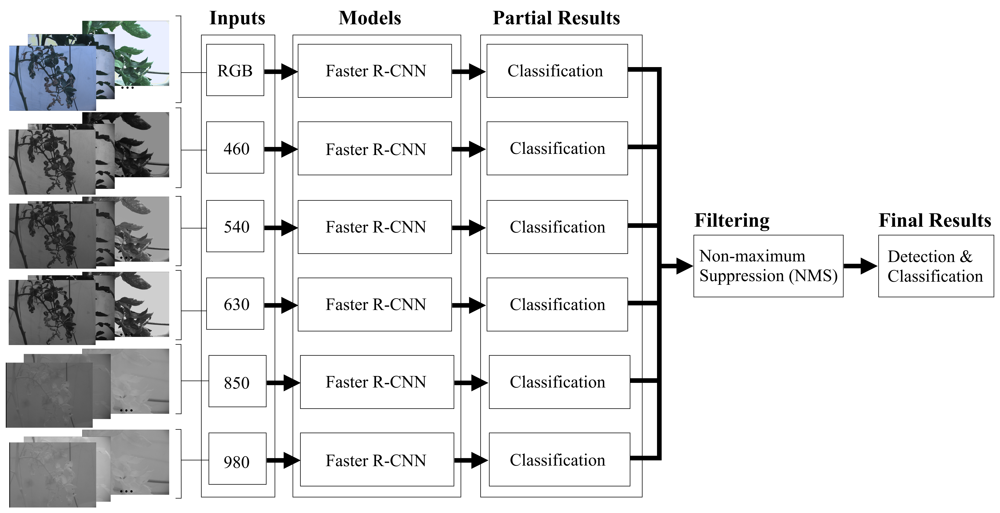
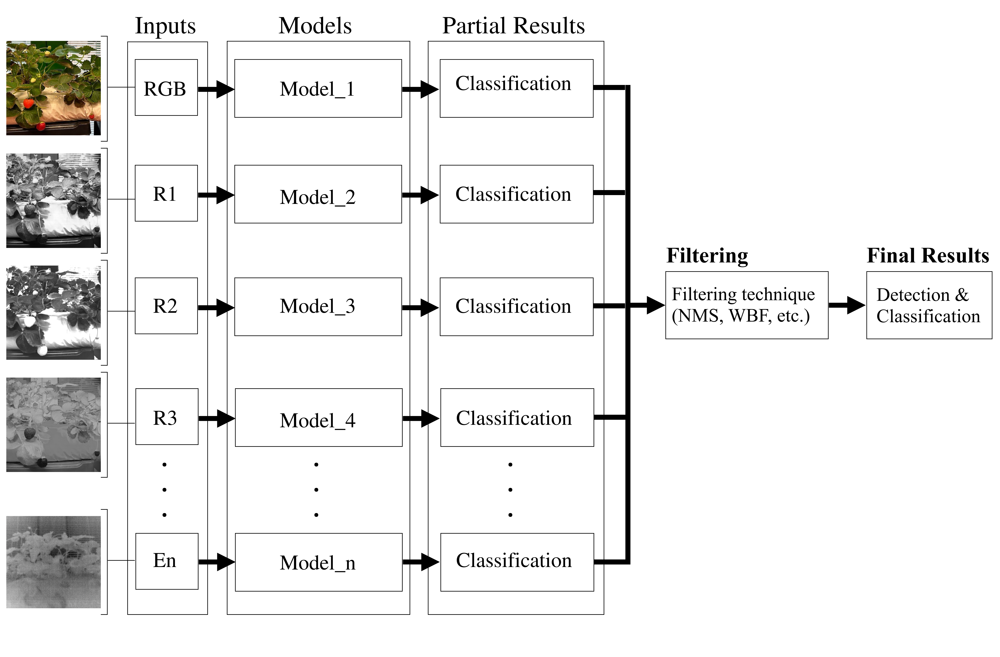

#  Multi-Model Ensemble (MME)

MME pipeline capable of handling the entire multidimensionality of multispectral data, or alternatively only the most informative bands, without the need for reduction, in order to maximise detection performance.

---

### MME architecture example
```
IMGs_RGB   ->  Model_RGB    -> bboxes lables scores ref_model -|
IMGs_460nm ->  Model_R460nm -> bboxes lables scores ref_model -| 
IMGs_540nm ->  Model_R540nm -> bboxes lables scores ref_model -| -> Merge -> NonMaxSoppresion -> Predictions (bboxes lables max-scores ref_models)
IMGs_630nm ->  Model_R630nm -> bboxes lables scores ref_model -| 
IMGs_850nm ->  Model_R850nm -> bboxes lables scores ref_model -|                                                     
IMGs_980nm ->  Model_R980nm -> bboxes lables scores ref_model _|
```




### MME conceptual illustration
The concept of the proposed MME methodology, in which input data can include various types of images, such as RGB, multispectral, thermal, false colour, vegetation indices, etc. The architectures used are flexible and range from individual models such as Faster R-CNN, YOLO, etc., to combinations of these models within the same pipeline. Techniques such as Weighted Boxes Fusion (WBF) can be integrated together with Non-Maximum Suppression (NMS) to refine the most relevant predictions. These strategies are geared towards maximising overall predictive performance.



---

### Install dependencies
pip install -r requirements.txt
